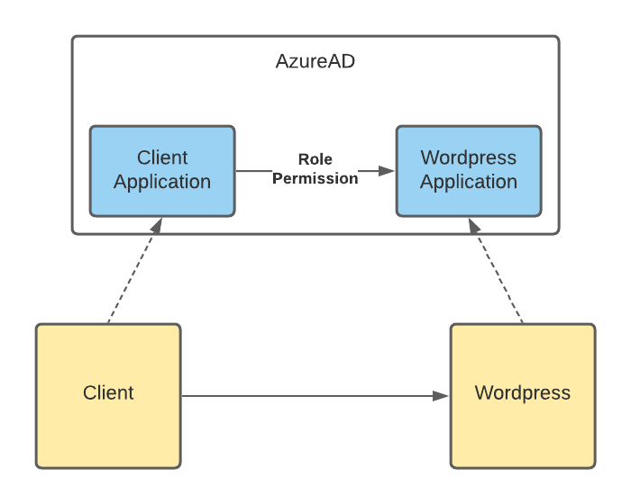

# PoC para demonstrar o acesso ao Wordpress usando Client Credentials

É necessário criar um registro de aplicativo no AzureAD para a aplicação cliente, com acesso a uma role exposta pelo registro de aplicativo do Wordpress.

<p align="center">
  
</p>

## Wordpress

1) Alterar as variaveis do cabeçalho do arquivo restrict.php;
    - AZUREAD_TOKEN_METADATA: Deixar o padrão ```https://login.microsoftonline.com/common/v2.0/.well-known/openid-configuration```
    - AZUREAD_WORDPRESS_AUDIENCE: **Application ID URI** da aplicação Wordpress no AzureAD
    - AZUREAD_WORDPRESS_ROLE: Role no AzureAD á qual a aplicação cliente tem, em relação ao AzureAD
    - APPLICATION_USER_ID: Id do usuário do Wordpress que será logado, ao final do processo
2) Adicionar o arquivo restrict.php ao root do site do wordpress;

## Cliente em C#
Atualizar as configurações referentes ao AzureAD no appsettings.json

## Configurar o Lifetime dos access tokens


E interessante reduzir o lifetime dos access_tokens, pois eles são usados apenas para setar o usuário do wordpress. Como fazer:
 https://docs.microsoft.com/en-us/azure/active-directory/develop/configure-token-lifetimes